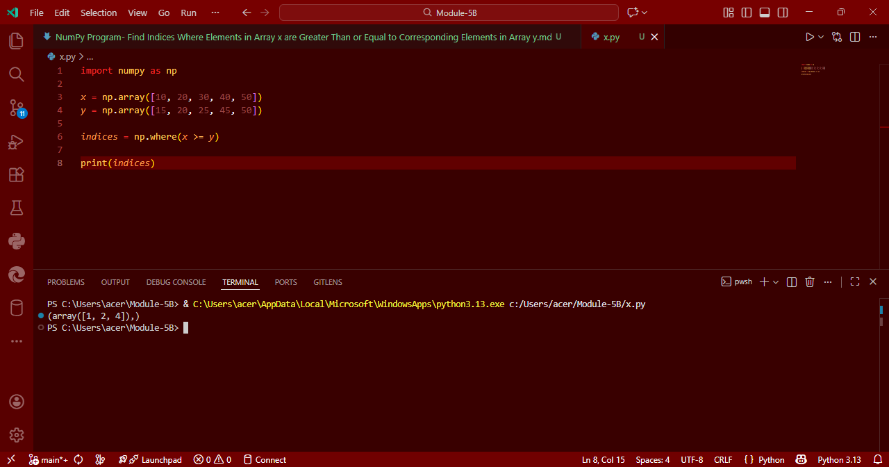

# # NumPy Program: Find Indices Where Elements in Array x are Greater Than or Equal to Corresponding Elements in Array y

## Aim
To write a Python program using **NumPy** that finds the indices where elements in array `x` are greater than or equal to their corresponding elements in array `y`.

## Algorithm
1. **Import NumPy**: Import the NumPy library.
2. **Define Arrays**: Define two NumPy arrays, `x` and `y`, with the same shape (i.e., same number of elements).
3. **Use Boolean Indexing**: 
   - `x > y` gives a boolean array where elements of `x` are greater than `y`.
   - `x == y` gives a boolean array where elements of `x` are equal to `y`.
4. **Find Indices**: Use `np.where()` to get the indices where the conditions `x >= y` are satisfied.
5. **Print Indices**: Print the indices where the condition holds true.

## Program
```
import numpy as np
x = np.array([10, 20, 30, 40, 50])
y = np.array([15, 20, 25, 45, 50])
indices = np.where(x >= y)
print(indices)
```

## Output


## Result
Thus, the Python program using NumPy successfully finds the indices where elements in array x are greater than or equal to the corresponding elements in array y.