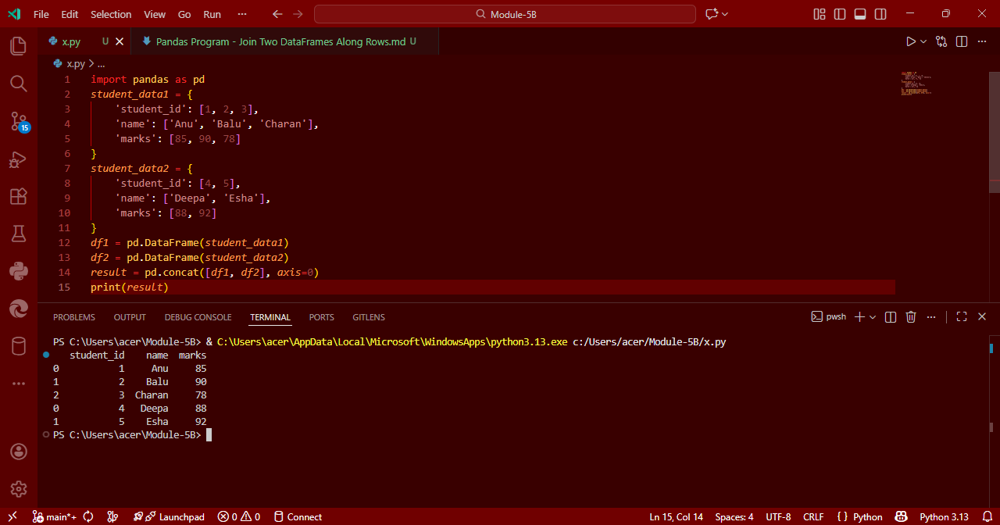

# Pandas Program: Join Two DataFrames Along Rows

## AIM

To write a Python program using Pandas to **join two DataFrames along rows** (row-wise concatenation) and assign all data to a new DataFrame.

---

## ALGORITHM

1. **Import Libraries**: Import the `pandas` library.
2. **Create First DataFrame**: Use a dictionary to create `student_data1`.
3. **Create Second DataFrame**: Use another dictionary to create `student_data2`.
4. **Concatenate DataFrames**: Use `pd.concat()` with `axis=0` to concatenate both DataFrames row-wise.
5. **Display Result**: Print the new combined DataFrame.

---

## Program
```
import pandas as pd
student_data1 = {
    'student_id': [1, 2, 3],
    'name': ['Anu', 'Balu', 'Charan'],
    'marks': [85, 90, 78]
}
student_data2 = {
    'student_id': [4, 5],
    'name': ['Deepa', 'Esha'],
    'marks': [88, 92]
}
df1 = pd.DataFrame(student_data1)
df2 = pd.DataFrame(student_data2)
result = pd.concat([df1, df2], axis=0)
print(result)
```
## Output


## Result
Thus, the Python program successfully joins two DataFrames along rows using Pandas.